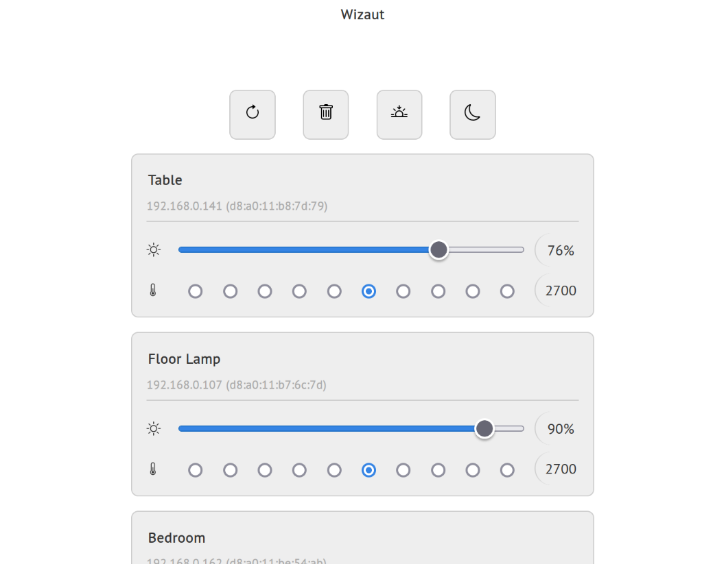

# Wizaut

Lightweight Web UI to manage WiZ lights. Made with Python, htmx, and some CSS.



## Usage

Run `wizaut` command and open `http://localhost:8001` in your browser. You can also create a config file at `/etc/wizaut.yaml` or `~/.config/wizaut.yaml` with the following content:

```yaml
host: 0.0.0.0
port: 8001
broadcast: 255.255.255.255
timeout: 10
devices:
  d8a011bc75c7: Couch
  d8a011b87d79: Table
  d8a011b76c7d: Floor Lamp
  d8a011be54ab: Bedroom
```
